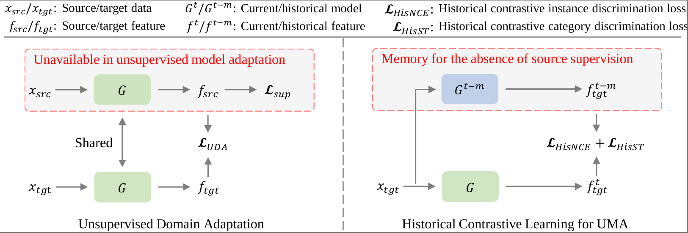

# RDA: Robust Domain Adaptation via Fourier Adversarial Attacking

### Updates

- *08/2021*: check out our domain adaptation for video segmentation paper [Domain Adaptive Video Segmentation via Temporal Consistency Regularization](https://arxiv.org/abs/2107.11004) (accepted to ICCV 2021). This paper presents DA-VSN, a domain adaptive video segmentation network that addresses domain gaps in videos by temporal consistency regularization (TCR) for consecutive frames of target-domain videos. [Code avaliable](https://github.com/Dayan-Guan/DA-VSN).
- *06/2021*: check out our domain adaptation for panoptic segmentation paper [Cross-View Regularization for Domain Adaptive Panoptic Segmentation](https://arxiv.org/abs/2103.02584) (accepted to CVPR 2021). We design a domain adaptive panoptic segmentation network that exploits inter-style consistency and inter-task regularization for optimal domain adaptation in panoptic segmentation.[Code avaliable](https://github.com/jxhuang0508/CVRN).
- *06/2021*: check out our domain adapation for sematic segmentation paper [Scale variance minimization for unsupervised domain adaptation in image segmentation](https://www.researchgate.net/publication/347421562_Scale_variance_minimization_for_unsupervised_domain_adaptation_in_image_segmentation)  (accepted to Pattern Recognition 2021). We design a scale variance minimization (DA-VSN) method by enforcing the intra-image semantic structure consistency in the target domain. [Code avaliable](https://github.com/Dayan-Guan/DA-VSN).
- *06/2021*: check out our domain adapation for object detection paper [Uncertainty-Aware Unsupervised Domain Adaptation in Object Detection](https://arxiv.org/abs/2103.00236) (accepted to IEEE TMM 2021). We design a uncertainty-aware domain adaptation network (UaDAN) that introduces conditional adversarial learning to align well-aligned and poorly-aligned samples separately in different manners. [Code avaliable](https://github.com/Dayan-Guan/UaDAN).


## Paper

[RDA: Robust Domain Adaptation via Fourier Adversarial Attacking](https://arxiv.org/abs/2106.02874)  
 [Jiaxing Huang](https://scholar.google.com/citations?user=czirNcwAAAAJ&hl=en&oi=ao), [Dayan Guan](https://scholar.google.com/citations?user=9jp9QAsAAAAJ&hl=en), [Xiao Aoran](https://scholar.google.com/citations?user=yGKsEpAAAAAJ&hl=en), [Shijian Lu](https://scholar.google.com/citations?user=uYmK-A0AAAAJ&hl=en)  
 School of Computer Science Engineering, Nanyang Technological University, Singapore  
 International Conference on Computer Vision, 2021.
 
If you find this code/paper useful for your research, please cite our [paper](https://arxiv.org/abs/2106.02874):

```
@article{huang2021rda,
  title={RDA: Robust Domain Adaptation via Fourier Adversarial Attacking},
  author={Huang, Jiaxing and Guan, Dayan and Xiao, Aoran and Lu, Shijian},
  journal={arXiv preprint arXiv:2106.02874},
  year={2021}
}
```

## Abstract

Unsupervised domain adaptation (UDA) involves a supervised loss in a labeled source domain and an unsupervised loss in an unlabeled target domain, which often faces more severe overfitting (than classical supervised learning) as the supervised source loss has clear domain gap and the unsupervised target loss is often noisy due to the lack of annotations. This paper presents RDA, a robust domain adaptation technique that introduces adversarial attacking to mitigate overfitting in UDA. We achieve robust domain adaptation by a novel Fourier adversarial attacking (FAA) method that allows large magnitude of perturbation noises but has minimal modification of image semantics, the former is critical to the effectiveness of its generated adversarial samples due to the existence of domain gaps. Specifically, FAA decomposes images into multiple frequency components (FCs) and generates adversarial samples by just perturbating certain FCs that capture little semantic information. With FAA-generated samples, the training can continue the random walk and drift into an area with a flat loss landscape, leading to more robust domain adaptation. Extensive experiments over multiple domain adaptation tasks show that RDA can work with different computer vision tasks with superior performance.

## Installation
1. Conda enviroment:
```bash
conda create -n rda python=3.6
conda activate rda
conda install -c menpo opencv
pip install torch==1.0.0 torchvision==0.2.1
```

2. Clone the [ADVENT](https://github.com/valeoai/ADVENT):
```bash
git clone https://github.com/valeoai/ADVENT.git
pip install -e ./ADVENT
```

3. Clone the [CRST](https://github.com/yzou2/CRST):
```bash
git clone https://github.com/yzou2/CRST.git
pip install packaging h5py
```

4. Clone the repo:
```bash
https://github.com/jxhuang0508/RDA.git
pip install -e ./RDA
cp RDA/crst/*py CRST
cp RDA/crst/deeplab/*py CRST/deeplab
```

### Prepare Dataset
* **GTA5**: Please follow the instructions [here](https://download.visinf.tu-darmstadt.de/data/from_games/) to download images and semantic segmentation annotations. The GTA5 dataset directory should have this basic structure:
```bash
RDA/data/GTA5/                               % GTA dataset root
RDA/data/GTA5/images/                        % GTA images
RDA/data/GTA5/labels/                        % Semantic segmentation labels
...
```

* **Cityscapes**: Please follow the instructions in [Cityscape](https://www.cityscapes-dataset.com/) to download the images and validation ground-truths. The Cityscapes dataset directory should have this basic structure:
```bash
RDA/data/Cityscapes/                         % Cityscapes dataset root
RDA/data/Cityscapes/leftImg8bit              % Cityscapes images
RDA/data/Cityscapes/leftImg8bit/val
RDA/data/Cityscapes/gtFine                   % Semantic segmentation labels
RDA/data/Cityscapes/gtFine/val
...
```

### Pre-trained models
Pre-trained models can be downloaded [here](https://github.com/jxhuang0508/RDA/releases/tag/Latest) and put in ```RDA/pretrained_models```

### Evaluation

To evaluate RDA_FAA_T:
```bash
cd RDA/CRST
python evaluate_advent.py --test-flipping --data-dir ../RDA/data/Cityscapes --restore-from ../RDA/pretrained_models/model_FAA_T.pth --save ../RDA/experiments/GTA2Cityscapes_RDA
```

To evaluate RDA_FAA_S_T:
```bash
cd RDA/CRST
python evaluate_advent.py --test-flipping --data-dir ../RDA/data/Cityscapes --restore-from ../RDA/pretrained_models/model_FAA_S_T.pth.pth --save ../RDA/experiments/GTA2Cityscapes_RDA
```

### Training
To train RDA_FAA_T:
```bash
cd RDA/rda/scripts
python train.py --cfg configs/RDA.yml
```

To test RDA_FAA_T:
```bash
cd RDA/CRST
./test_best.sh
```

## Acknowledgements
This codebase is heavily borrowed from [ADVENT](https://github.com/valeoai/ADVENT) and [CRST](https://github.com/yzou2/CRST).

## Contact
If you have any questions, please contact: jiaxing.huang@ntu.edu.sg
